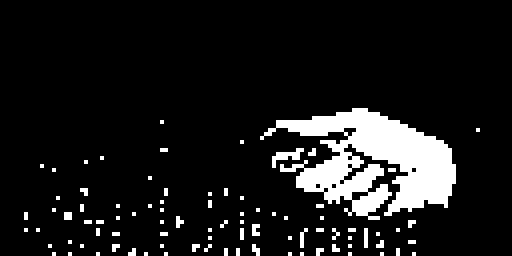
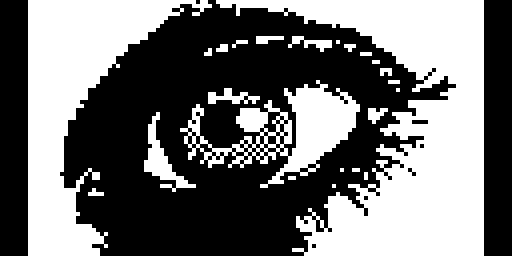
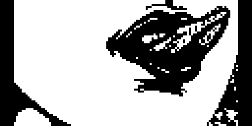
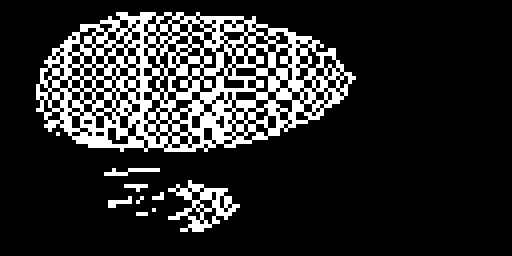
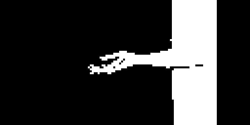
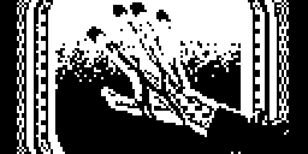
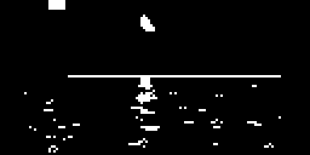
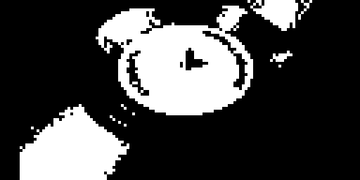
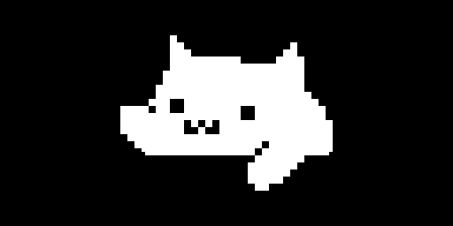

# Digitakt & Digitone splash mods

Boot-splash mods for the Elektron **Digitakt mk1** (OS 1.53) and **Digitone
mk1 / Digitone Keys** (OS 1.43), built for
[elekloader](https://github.com/irpina/elekloader). They
change only the main OS section, need the matching `core` mod, and can be
combined with other non-conflicting mods. No Elektron firmware is included.




## Digitakt mk1 (OS 1.53)

| mod | what it does | sources |
|---|---|---|
| [`rare-splash`](mods/rare-splash) | boots on the **alternate** stock animation, the one the unseeded selector never reaches | 1 instruction |
| [`digitussy`](mods/digitussy) | animated: the **DIGITUSSY** wordmark bobbing over rising particles | C + asm |
| [`digitrash`](mods/digitrash) | animated: the **DIGITRASH** wordmark and a trash can with six flying flies | C + asm |
| [`aba-bootanim`](mods/aba-bootanim) | example **animated GIF** splash, generated by `make-bootanim` from `aba.gif` | asm |


*(left: the usual boot animation, ~367 lit pixels — right: the rare one,
~666; both captured from a real 1.53 image in digiemu.)*

## Digitone mk1 / Digitone Keys (OS 1.43)

The same mods, ported, plus the generated example (see [`digitone1/`](digitone1)
for the addresses). The panel is the same screen, so the graphics and image
format are identical.


| mod | |
|---|---|
| [`digitone1/mods/rare-splash`](digitone1/mods/rare-splash) | the alternate stock animation |
| [`digitone1/mods/digitussy`](digitone1/mods/digitussy) | animated wordmark + particles |
| [`digitone1/mods/digitrash`](digitone1/mods/digitrash) | animated wordmark + flies |
| [`digitone1/mods/aba-bootanim`](digitone1/mods/aba-bootanim) | example animated GIF from `make-bootanim` |

## Conflicts

`digitussy`, `digitrash` and `aba-bootanim` draw over the intro;
`rare-splash` changes which stock animation runs. The three draw mods hook the
same present sites, so install **one** of them; `rare-splash` patches a
different instruction and combines with any of them. The same rule holds within
each device section (a Digitakt mod and a Digitone mod are never combined — they
target different OS files).

## Releases

The **DigiSplash 1.1** release is twelve splashes, in [`releases/`](releases)
(`dt/` for the Digitakt, `dn/` for the Digitone) and as elemods-only zips.
Install one draw mod at a time — see [releases/README.md](releases/README.md).











## Quick start

```sh
cd elekloader

# Digitakt mk1: build a mod, then a flashable firmware with core
python -m elekloader.sdk.build ../digitakt-splash-mods/mods/digitussy --stock Digitakt_OS1.53.syx
python -m elekloader.patch --stock Digitakt_OS1.53.syx \
    --mod mods/core/out/core-2.1.elemod \
    --mod ../digitakt-splash-mods/mods/digitussy/out/digitussy-1.0.elemod \
    --out digitussy.syx --version 2.0s

# Digitone mk1 / Keys: the same, with the Digitone stock and core-dn1
python -m elekloader.sdk.build ../digitakt-splash-mods/digitone1/mods/digitussy \
    --stock Digitone_and_Digitone_Keys_OS1.43.syx
python -m elekloader.patch --stock Digitone_and_Digitone_Keys_OS1.43.syx \
    --mod mods/core-dn1/out/core-dn1-2.0a.elemod \
    --mod ../digitakt-splash-mods/digitone1/mods/digitussy/out/digitussy-1.0.elemod \
    --out digitussy-dn1.syx --version 2.0s
```

`digitussy`, `digitrash` and the generated bootanims need the m68k toolchain
(C and assembly); **`rare-splash` has no sources and builds without it**.

## Make your own from a PNG or GIF

[`tools/make-bootanim/`](tools/make-bootanim) turns an image or an animated GIF
into a ready-to-build splash mod (a multi-frame animation, or a single frame):




```sh
tools\make-bootanim\make-bootanim.bat hamster.gif
tools\make-bootanim\make-bootanim.bat logo.png --name "My logo" --dn
```

It writes the mod folder (frames, `splash.s`, `mod.json`); build and install
it with elekloader as above. See
[tools/make-bootanim/README.md](tools/make-bootanim/README.md). The committed
[`aba-bootanim`](mods/aba-bootanim) mod (and its
[Digitone twin](digitone1/mods/aba-bootanim)) was made this way from
[`tools/make-bootanim/aba.gif`](tools/make-bootanim/aba.gif).

## Documentation

| | |
|---|---|
| [docs/BUILDING.md](docs/BUILDING.md) | the toolchain, `sdk.build`, `lint`, and how a `.elemod` is checked |
| [docs/INSTALLING.md](docs/INSTALLING.md) | `elekloader.patch`, flashing, recovery, which mods conflict |
| [docs/PANEL-FORMAT.md](docs/PANEL-FORMAT.md) | the 128x64 1bpp panel layout and how to make art for it |
| [docs/TECHNICAL.md](docs/TECHNICAL.md) | how the intro selects and presents, and where each mod hooks |
| [digitone1/README.md](digitone1/README.md) | the Digitone addresses and build/install commands |
| [tools/re/README.md](tools/re/README.md) | reverse-engineering and capture instruments |
| [releases/](releases) | prebuilt `.elemod` files, DT and DN variants |
| [NOTICE.md](NOTICE.md) | licence and the independence statement |

## Layout

```
mods/<id>/                Digitakt mk1 mods (elekloader format 2)
digitone1/mods/<id>/      Digitone mk1 / Keys mods
mods/<id>/*.s,*.c         sources;  out/ is build output (gitignored)
tools/make-bootanim/      PNG/GIF -> splash mod generator
tools/re/                 reverse-engineering and capture instruments
releases/                 prebuilt .elemod files (dt/, dn/)
screenshots/              captured in digiemu
docs/                     the guides above
```

## Licence

The mods are GPL-2.0-or-later (see [LICENSE](LICENSE)). Digitakt, Digitone and
Elektron are trademarks of their respective owners; this project is
independent and is not affiliated with or endorsed by Elektron.
