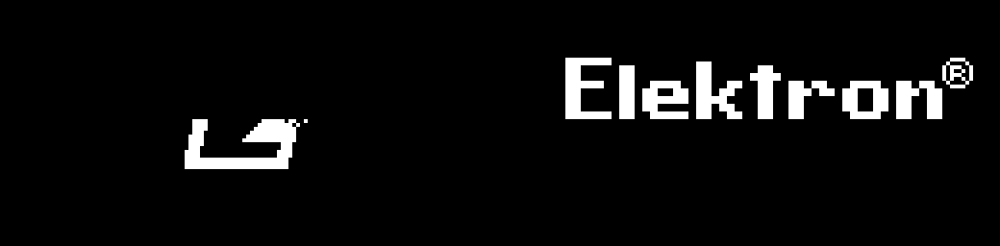

# How the splash works, and where each mod hooks

Addresses are runtime addresses of the Digitakt mk1 **OS 1.53** main OS,
which loads at `0x40000400` (subtract that for a file offset in the
decompressed section 3).

## The intro task and its selector

The boot animation is drawn by the intro task, entry `0x4006c2ae`. It draws
one pseudo-random number and picks between two whole animations:

```
0x4006c2f0  jsr    (a6)          ; a6 = 0x40105910, rand()
0x4006c2f2  mvs.w  d0, d0
0x4006c2f4  cmpi.l #$7fdf, d0    ; 32735
0x4006c2fa  ble.w  0x4006c3d2    ; ~99.9% -> the usual animation
            <falls through>      ; ~0.1%  -> the alternate animation
```

The generator at `0x40105910` is the ANSI C reference LCG:

```
state = state * 0x41c64e6d + 0x3039      (mod 2^32)
out   = (state >> 16) & 0x7fff
```

Its state (`0x406481e8`) is written only by the generator itself and by a
setter at `0x4010595a` that nothing calls. **It is never seeded**, so the draw
is the same on every boot and the 0.1% branch is effectively unreachable — the
same defect the Digitakt II splash has.

The usual path then splits once more on a factory-test flag into scene A
(`0x4006c3e4`) and scene B (`0x4006c89e`); the rare path starts at
`0x4006c2fe`. Both animations are generated in code (softfloat particle
fields) — there is no stored image to swap.



The usual animation peaks around **367 lit pixels**, the rare one around
**666**; `screenshots/usual-splash.gif` and `screenshots/rare-splash.gif` are
emulator captures.

## Presenting a frame

The intro draws into one of two 1024-byte panel buffers and presents it:

| | |
|---|---|
| `0x4020d8f8` / `0x4020d8fc` | the front / back buffer pointers |
| `0x400e60e2` | delta present: diff front vs back, flush, swap |
| `0x400e6064` | full present: flush all 8 pages, swap |

The active animation calls one of those once per frame. Its PIT3 handler
(`0x4006c154`, vector slot `0x40000340`) owns the timer for the whole
intro; when the display module claims the vector the intro is over.

## `rare-splash`

One instruction. The branch at `0x4006c2fa` is replaced so execution always
falls through to the alternate animation:

| address | stock | new |
|---|---|---|
| `0x4006c2fa` | `6f 00 00 d6` (`ble.w`) | `4e 71 4e 71` (`nop; nop`) |

No sources, so it builds without a toolchain.

## `custom-splash`, `digitussy`, `digitrash`

These draw over each composed frame at the intro's **present call sites** and
then run the stock present:

| present | intro call sites (all patched) |
|---|---|
| `0x400e60e2` | `0x4006c2d0`, `0x4006c3ac`, `0x4006c864`, `0x4006cb68` |
| `0x400e6064` | `0x4006c3a4`, `0x4006c85c`, `0x4006cb60` |

Each new `stub` (`jsr <draw>` then `jmp <stock present>`) keeps the stock
present functions intact.

**Why the call sites, not the present entry.** An earlier version of
`custom-splash` redirected `0x400e60e2` itself (`op: jmp`). That works on
hardware, but it changes bytes the emulator's symbol scan uses to find
`panel_diff` and `fb_front`, so digiemu could no longer resolve the panel and
its firmware check reported "did not reach a live UI". Hooking the intro's own
call sites leaves those signatures intact, so a build can still be checked in
the emulator.

`custom-splash` ships a fixed 1024-byte `splash.bin`; the two animated mods
compute each frame from a small C renderer (a 5×7 font, an LCG, particles /
flies). See [PANEL-FORMAT.md](PANEL-FORMAT.md).

All three gate on `0x40000340 == 0x4006c154` (the intro still owning PIT3), so
nothing is drawn over the user interface.

## Digitone mk1 / Digitone Keys (OS 1.43)

The Digitone intro is the Digitakt's code, relinked: same selector, same
double-buffered present, same LCG. Only the addresses move, and the intro calls
the present nine times (five delta, four full) rather than seven. The ported
mods and a full address table are in [../digitone1/README.md](../digitone1/README.md);
`core-dn1` is the core mod. The panel and its format are identical.
