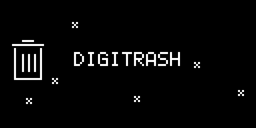

# digitrash

An animated boot splash: the **DIGITRASH** wordmark and a trash can with six
flies buzzing and wandering around them. Needs `core`.



## How it works

`render.c` draws every frame at the intro's panel-present call sites, over the
frame the intro just composed:

- a 5x7 font spells the wordmark, jittering by a pixel each frame;
- a trash can is outlined with `hline`/`vline` helpers;
- six flies (`#.#` / `.#.` / `#.#`) random-walk with occasional darts and
  bounce off the edges;
- it gates on the intro still owning PIT3, so the UI is untouched.

See [../../docs/TECHNICAL.md](../../docs/TECHNICAL.md).

## Build and install

Needs the m68k toolchain (see [../../docs/BUILDING.md](../../docs/BUILDING.md)).

```sh
export ELEKLOADER_CROSS=m68k-elf-          # or your prefix
export PATH=/c/sysgcc/m68k-elf/bin:$PATH
cd elekloader
python -m elekloader.sdk.build ../digitakt-splash-mods/mods/digitrash --stock Digitakt_OS1.53.syx
python -m elekloader.patch --stock Digitakt_OS1.53.syx \
    --mod mods/core/out/core-2.1.elemod \
    --mod ../digitakt-splash-mods/mods/digitrash/out/digitrash-1.0.elemod \
    --out digitrash.syx --version 2.0s
```

Install only one of `digitussy`, `digitrash` and `rare-splash` (they overlap).
