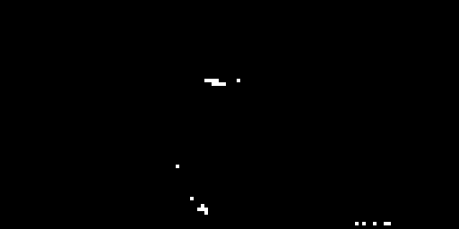
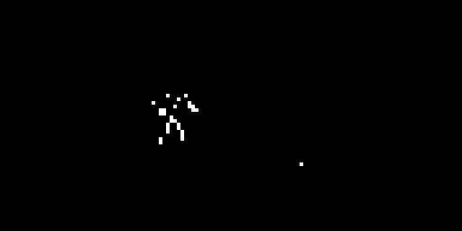
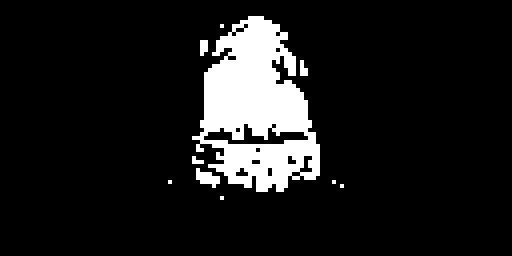
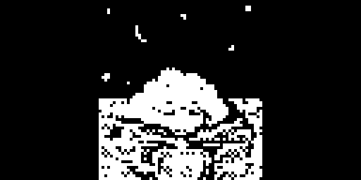

# releases

Prebuilt splash mods — **only `.elemod` files**, one per splash, in both
device variants:

- `dt/` — Digitakt mk1, OS 1.53 (needs `core`, e.g. `core-2.1.elemod`)
- `dn/` — Digitone mk1 / Keys, OS 1.43 (needs `core-dn1`, e.g.
  `core-dn1-2.0a.elemod`)

Each device is also packaged as a zip:

- `DigiSplash-1.0-<device>.zip` — the full set, with sources
  (`elemods/` + `sources/` + README + LICENSE).
- `DigiSplash-1.1-<device>.zip` — the twelve-featured release, **elemods only**
  (`elemods/` + README + LICENSE): `rare-splash`, `digitussy`, `digitrash`,
  `aba-bootanim`, `reach`, `claw`, `tidemoon`, `vinyl`, `match`, `bzme`,
  `tussy`, `loox`.

| mod | what |
|---|---|
| `rare-splash` | the alternate stock boot animation, the one the unseeded selector never reaches |
| `digitussy` | animated wordmark + rising particles |
| `digitrash` | animated wordmark, trash can and six flies |
| `aba-bootanim` | the `aba.gif` example animation |
| `beep`, `catbooting`, `catscan`, `discover`, `experience`, `mount`, `pfft`, `planet1` | generated splashes from the source images |
| `loop` | the animated GIF (`c8aabc53….gif`), 40 frames |
| `milkyway`, `kofight`, `horror` | animated GIFs (`o7o4p1bwd01b1`, `4rr4lhq45rb81` and `HORROR`), 40, 60 and 48 frames |
| `majestic`, `loox`, `tussy` | animated GIFs (`zs00wgb204te1`, `1_CqtKSeLhUEUfiXsnYMqfbQ` and `Primp`), 32, 35 and 59 frames |
| `bzme` | the animated GIF `bzme.gif`, 14 frames |
| `reach`, `claw`, `tidemoon` | animated GIFs (`0efb8c5f…`, `b6906df9…` and `Qd87v2`), 18, 18 and 60 frames |
| `vinyl`, `match` | animated GIFs (`tumblr_1edd57ba…` and `tumblr_n8ggiog…`), 24 and 41 frames |

`catbooting`, `catscan`, `mount`, … are static (one frame); `loop`, `milkyway`,
`kofight`, `horror`, `majestic`, `loox`, `tussy`, `bzme`, `reach`, `claw`,
`tidemoon`, `vinyl`, `match` and the `digitussy`/`digitrash`/`aba-bootanim`
ones animate.

A rendered screenshot of each (in [`screenshots/`](screenshots)); `reach`,
`claw`, `tidemoon`, `vinyl` and `match` are captured from the emulator
(digiemu), one full animation cycle each:








## Install

With elekloader:

```sh
python -m elekloader.patch --stock Digitakt_OS1.53.syx \
    --mod mods/core/out/core-2.1.elemod \
    --mod releases/dt/mount.elemod --out mount.syx --version 2.0x

python -m elekloader.patch --stock Digitone_and_Digitone_Keys_OS1.43.syx \
    --mod mods/core-dn1/out/core-dn1-2.0a.elemod \
    --mod releases/dn/mount.elemod --out mount-dn.syx --version 2.0x
```

Or drop the `.elemod` into the loader window (Install from file) together with
the matching core.

## Conflict

Every mod here except `rare-splash` is a **draw mod**: they hook the same
intro present call sites, so install **one** of them. `rare-splash` patches a
different instruction and can be combined, but a draw mod paints the whole
frame, so `rare-splash` is then invisible — install it alone to see the
alternate stock animation.

## Notes

- These `.elemod` files contain the mod's own bytes (including the packed
  frames); no Elektron firmware. See [../NOTICE.md](../NOTICE.md).
- Rebuild any of them with `elekloader.sdk.build` from the sources under
  `../mods`, `../digitone1/mods`, or regenerate a bootanim with
  [`../tools/make-bootanim`](../tools/make-bootanim).

## DigiScreen overlays

This `releases/` tree is **boot animations only**. The **DigiScreen** overlay
mods — which toggle a full-panel image over the *live UI* with `TRK`+`YES`
(Digitakt) / `MIDI`+`YES` (Digitone), press again to remove — are not shipped
here. They live in the DigiScreen project's own releases:

- `../DigiScreen/releases/<name>-dt.elemod` (Digitakt mk1)
- `../DigiScreen/releases/<name>-dn.elemod` (Digitone mk1 / Keys)

built from the same animations (`loox`, `tussy`, `bzme`, `reach`, `claw`,
`tidemoon`, …) with `../DigiScreen/tools/make_machine.py`.
