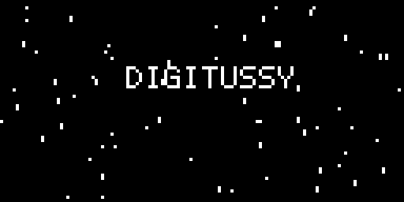
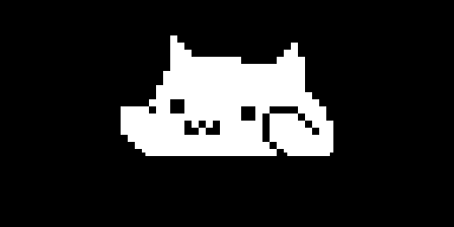
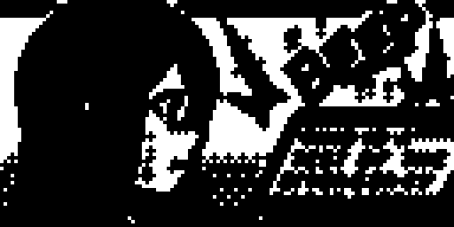
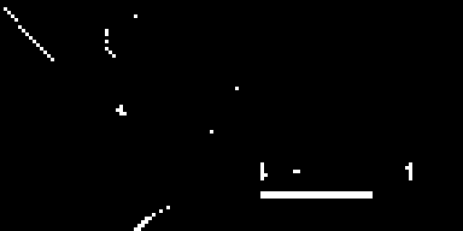
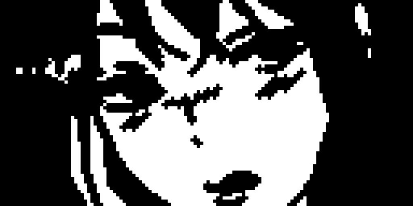
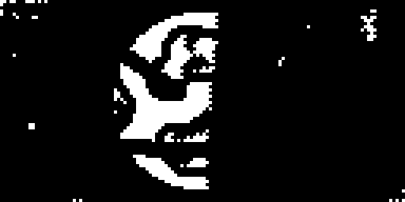
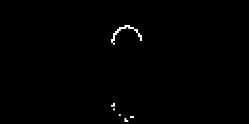

# releases

Prebuilt splash mods — **only `.elemod` files**, one per splash, in both
device variants:

- `dt/` — Digitakt mk1, OS 1.53 (needs `core`, e.g. `core-2.1.elemod`)
- `dn/` — Digitone mk1 / Keys, OS 1.43 (needs `core-dn1`, e.g.
  `core-dn1-2.0a.elemod`)

Each device is also packaged as a zip with the elemods **and** the sources of
every mod: `DigiSplash-1.0-digitakt-mk1.zip` and
`DigiSplash-1.0-digitone-mk1.zip` (`elemods/` + `sources/` + README + LICENSE).

| mod | what |
|---|---|
| `rare-splash` | the alternate stock boot animation, the one the unseeded selector never reaches |
| `digitussy` | animated wordmark + rising particles |
| `digitrash` | animated wordmark, trash can and six flies |
| `aba-bootanim` | the `aba.gif` example animation |
| `beep`, `catbooting`, `catscan`, `discover`, `experience`, `mount`, `pfft`, `planet1` | generated splashes from the source images |
| `loop` | the animated GIF (`c8aabc53….gif`), 40 frames |

`catbooting`, `catscan`, `mount`, … are static (one frame); `loop` and the
`digitussy`/`digitrash`/`aba-bootanim` ones animate.

A rendered screenshot of each (in [`screenshots/`](screenshots)):














## Install

With elekloader:

```sh
python -m elekloader.patch --stock Digitakt_OS1.53.syx \
    --mod mods/core/out/core-2.1.elemod \
    --mod releases/dt/mount.elemod --out mount.syx --version 2.0x

python -m elekloader.patch --stock Digitone_and_Digitone_Keys_OS1.43.syx \
    --mod mods/core-dn1/out/core-dn1-2.0a.elemod \
    --mod releases/dn/mount.elemod --out mount-dn.syx --version 2.0x
```

Or drop the `.elemod` into the loader window (Install from file) together with
the matching core.

## Conflict

Every mod here except `rare-splash` is a **draw mod**: they hook the same
intro present call sites, so install **one** of them. `rare-splash` patches a
different instruction and can be combined, but a draw mod paints the whole
frame, so `rare-splash` is then invisible — install it alone to see the
alternate stock animation.

## Notes

- These `.elemod` files contain the mod's own bytes (including the packed
  frames); no Elektron firmware. See [../NOTICE.md](../NOTICE.md).
- Rebuild any of them with `elekloader.sdk.build` from the sources under
  `../mods`, `../digitone1/mods`, or regenerate a bootanim with
  [`../tools/make-bootanim`](../tools/make-bootanim).
